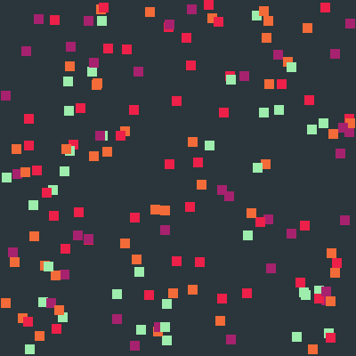
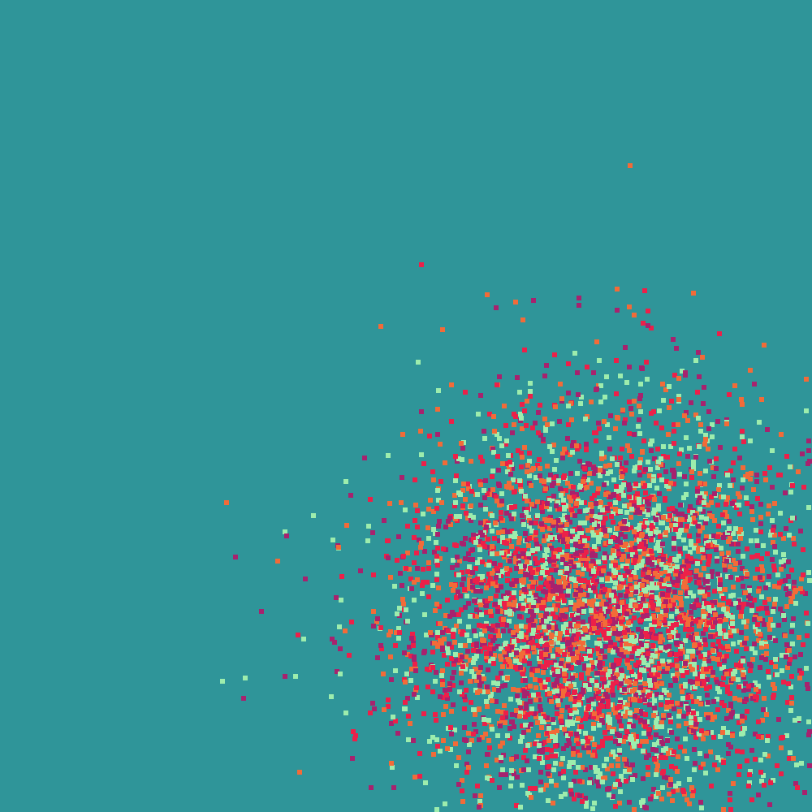
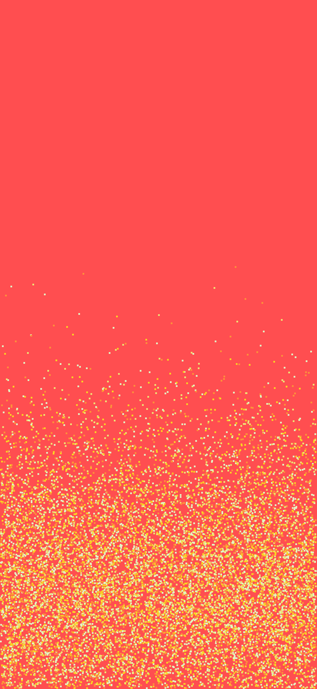

# Virgo Wallpaper Generator

> A Ruby CLI that generates beatiful random wallpapers.

**Now 30x faster! I wrote out my optimization process [in this article](https://nickymarino.com/2020/01/21/optimizing-virgo/).**


## Introduction

Virgo is a CLI written in Ruby to generate background art. Virgo takes a number of configuration options detailed below.

In progress and future steps are detailed below in the section [**Future Steps**](#future-steps).

This project was inspired by the galaxy [Virgo A](https://en.wikipedia.org/wiki/Messier_87), also known as the [Thousand-Ruby Galaxy](https://apod.nasa.gov/apod/ap151008.html).

## Installation

First, install Ruby on your machine by following [these steps](https://phoenixnap.com/kb/install-ruby-on-windows-10).

Then, clone this repo:

```
git clone https://github.com/nickymarino/virgo.git
```

## Quick Start

 To use Virgo, download this repo and run this command to create a wallpaper with the default settings saved to `output.png`:

```bash
./virgo.rb save output.png
```

## Future Steps

- [ ] Add a web view to call the CLI (in progress!)
- [ ] Publish this repo as a publicly available gem
- [ ] Add more shapes outside of square pixels

## Commands

### Save one Wallpaper

To save a wallpaper to `PATH`, use this command:
```
./virgo.rb save PATH [options]
```

Options:

```
    --background BACKGROUND
        Wallpaper background as a hexcode. Use list_backgrounds to list predefined background names

    --foregrounds FOREGROUNDS
        Wallpaper foregrounds as hexcodes separated by commas. Use list_foregrounds to list predefined foreground names

    --width PIXELS
        Width of the wallpaper

    --height PIXELS
        Height of the wallpaper

    --density RATIO
        Ratio of pixels to size of the image, as an integer percentage

    --diameter PIXELS
        Diameter of each pixel drawn on the wallpaper
```

Examples:

```
# Save a random wallpaper with default options
./virgo.rb save

# Save a wallpaper with a white background and black pixels
./virgo.rb save --background "#ffffff" --foregrounds "#000000"

# Save a wallpaper with predefined theme names as test.png
./virgo.rb save --background dark_blue --foreground sunset --width 100 --height 100 --density 2 --diameter 1 --path test.png
```

### Save Example Wallpapers

To write examples of wallpapers to `FOLDER`:

```
./virgo.rb save_examples FOLDER
```

Examples can also be found in the [examples](https://github.com/nickymarino/virgo/tree/master/examples) folder.

### List Background Names

To list all predefined background names and their hex codes:

```
$ ./virgo.rb list_backgrounds

black: #000000
white: #ffffff
dark_blue: #355c7d
chalkboard: #2a363b
peach: #ff8c94
gray: #363636
teal: #2f9599
orange: ff4e50
brown: #594f4f
gray_green: #83af9b
```

### List Foreground Names

To list all predefined foreground names and their hex codes:

```
$ ./virgo.rb list_foregrounds

white: ["#ffffff"]
ruby: ["#8d241f", "#a22924", "#b72f28", "#cc342d", "#d4453e", "#d95953", "#de6d68"]
sunset: ["#f8b195", "#f67280", "#c06c84", "#6c5b7b"]
primaries: ["#99b898", "#feceab", "#ff847c", "#e84a5f"]
primaries_light: ["#a8e6ce", "#bcedc2", "#ffd3b5", "#ffaaa6"]
gothic: ["#a8a7a7", "#cc527a", "#e8175d", "#474747"]
solar: ["#a7226e", "#ec2049", "#f26b38", "#9dedad"]
yellows: ["#e1f5c4", "#ede574", "#f9d423", "#fc913a"]
earth: ["#e5fcc2", "#9de0ad", "#45ada8", "#547980"]
faded: ["#fe4365", "#fc9d9a", "#f9cdad", "#c8c8a9"]
```

## More Example Images







